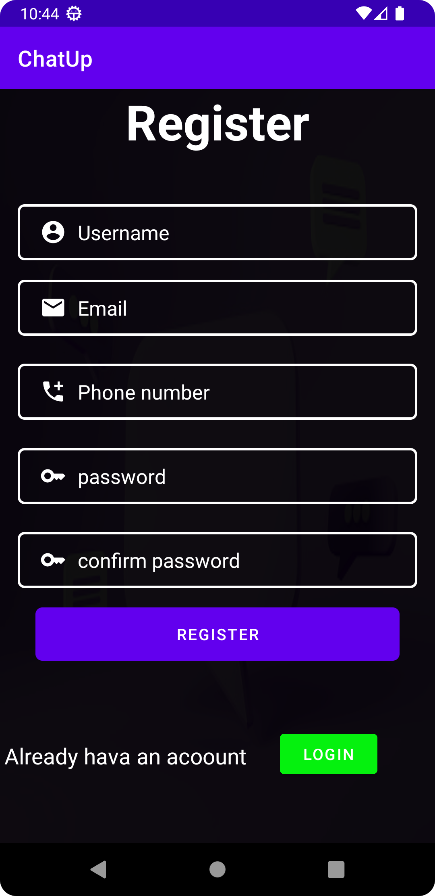
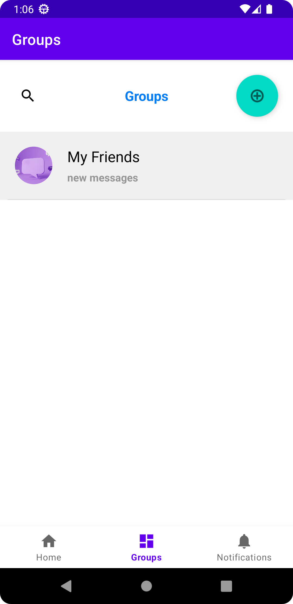

# Chatup: Real-time Chat Application

Welcome to Chatup, your open-source solution for creating real-time chat applications with friends! This project leverages the power of Firebase to provide a seamless and interactive chatting experience.

## Overview

Chatup is designed with simplicity and extensibility in mind. Whether you're building a social networking platform, a collaborative project management tool, or just a fun way to stay connected with friends, Chatup has you covered.

## Key Features

- **Real-time Communication**: Enjoy instant messaging with your friends in a real-time environment, thanks to Firebase's powerful real-time database.

- **User Authentication**: Securely authenticate users with Firebase Authentication, ensuring a personalized and safe chatting experience.

- **Responsive Design**: Chatup is built to be responsive across various devices, allowing your users to chat on the go.

- **Open Source**: Chatup is released under an open-source license, encouraging collaboration and allowing developers to customize and extend the application according to their needs.

## Getting Started

Getting started with Chatup is a breeze! Simply follow our comprehensive documentation to set up your Firebase project, configure the app, and start chatting with friends in no time.

## Contributing

We believe in the power of collaboration. Whether you're fixing a bug, adding a new feature, or improving the documentation, your contributions are welcome! Check out our contribution guidelines to get started.

## Support and Community

If you have questions, need assistance, or want to share your experience, join our friendly community on [GitHub Discussions](link-to-discussions) or [our community forum](link-to-forum).

Let's Chatup the world together!

Happy coding! 🚀
